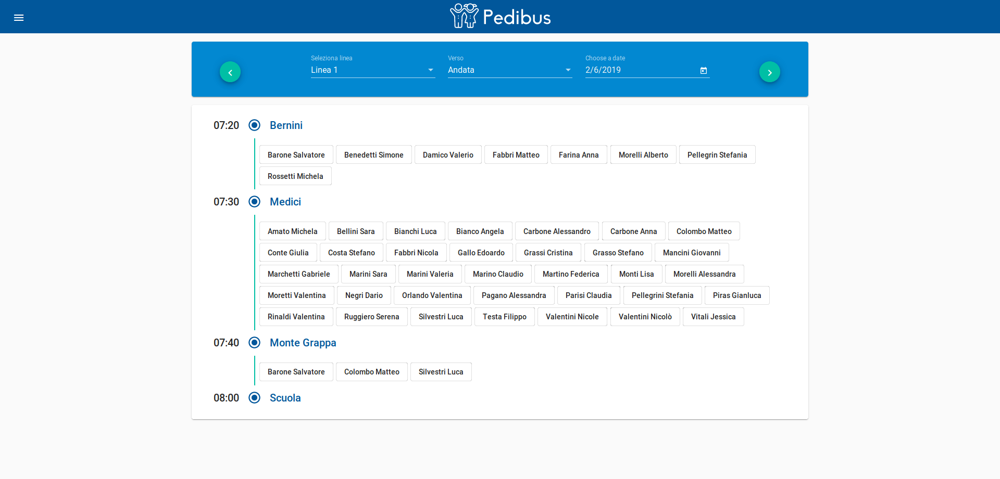

# Esercitazione 4
## Composizione Gruppo

Il gruppo MMAP è composto da:
- **Marco Florian** - s247030
- **Piero Macaluso** - s252894
- **Marco Nanci** - s255089
- **Angelo Turco** - s255270

## Avvio Applicazione
1. Dopo aver scompattato l'archivio `mmap-lab04-v1.zip`, posizionarsi da terminale nella cartella `mmap-lab04-v1`
2. Avviare il comando: `npm install`
3. Avviare il comando: `npm start`
4. Aprire il browser e dirigersi su `http://localhost:4200`

## Dati di prova

In questa esercitazione abbiamo inserito dei dati fittizi che andranno a popolare la data corrente e la data immediatamente successiva.

Ad esempio se l'esercitazione viene aperta in data 05/06/2019, le prenotazioni e le linee disponibili saranno popolate nelle date 05/06/2019 e 06/06/2019.

## Utilizzo dell'app
### Header
Nell'header è presente solo il logo principale, non avendo altre funzionalità da raggiungere.
Abbiamo comunque provato a inserire un Menù laterale (Drawer) con qualche voce di prova
che svilupperemo più avanti.

### Selezione linea, verso e data
Nella parte alta della schermata principale è possibile selezionare linea (Linea 1, Linea 2), verso (Andata, Ritorno) e data per visualizzare i dettagli di una linea.
Sono disponibili anche due frecce per cambiare giorno velocemente.

### Prenotazioni e Presenze
Nel corpo centrale dell'app vengono mostrate le fermate con l'elenco alfabetico degli alunni
prenotati. L'accompagnatore potrà contrassegnare gli alunni come presenti premendo sul
loro nome. Il pulsante bianco indica un alunno prenotato di cui non è stata confermata la presenza,
mentre il pulsante color verde acqua rappresenta un alunno
con presenza alla fermata confermata.

All'avvio dell'applicazione i pulsanti saranno tutti bianchi come default. 

### Esempio di utilizzo
In questa veloce GIF mostriamo l'utilizzo dell'applicazione.

